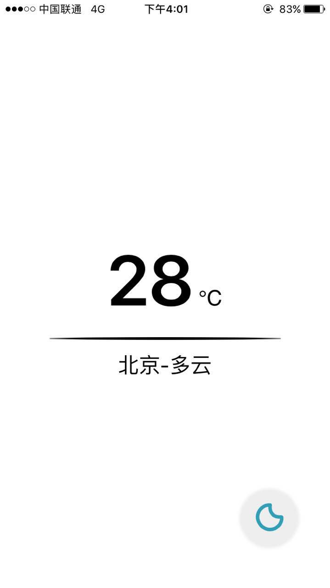
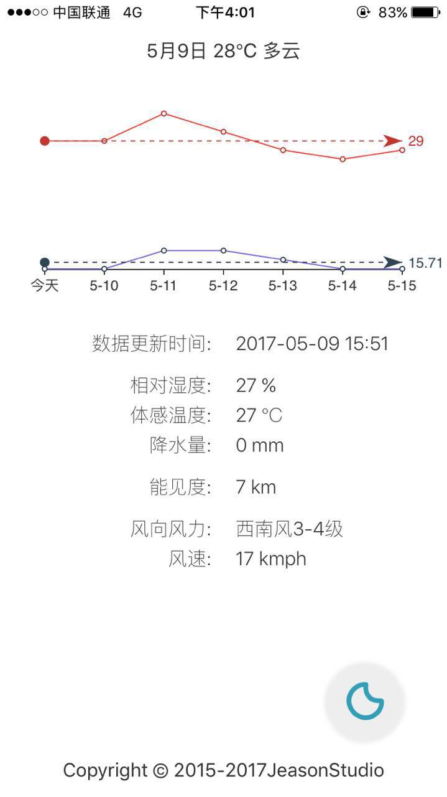
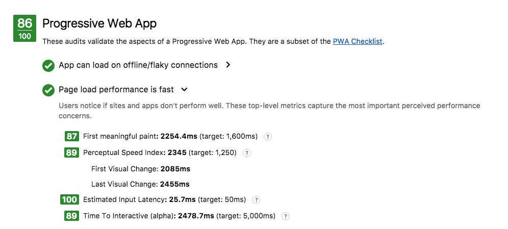
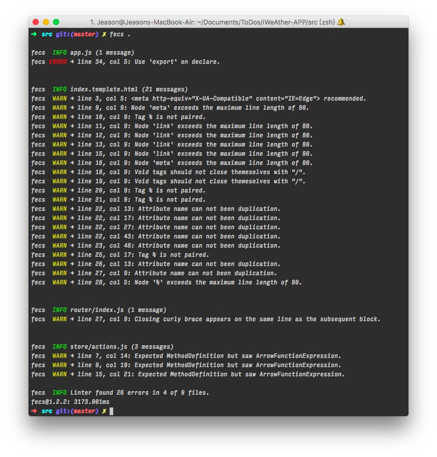

iWeAther-APP
===

> Author: Jeason

## Live Demo:

[https://jeasonstudio.github.io/iWeAther-APP/](https://jeasonstudio.github.io/iWeAther-APP/#/)

## 产品截图和演示：

first | second | GIF
----- | ------ | ---
 |  | GIF 比较大，请戳 [GIF](show/test.gif)

## 简要说明

### 实现了一个简单的 MVVM 库

最开始拿到这个题目，由于不太想使用 AngularJS、VueJS or ReactJS 这三个现成库（框架），但又需要其部分功能，又加上自己一直想实现一个轻量级的 MVVM框架，于是自己写了一个类似 Vue 的 MVVM 框架半成品，详见 [knopper.js](utils/knopper.js)。

目前实现了 k-module, k-click 和 k-repeat 的功能。将来可能会实现 k-if/k-on 等。（但此项目考虑到种种因素，没有用它，还是用的 VUE）

`knopper.js` 名字是因为在写它的时候正在吃 `knoppers` 饼干，它的主要原理基于 `ES2016 的 Proxy 和 Reflect`。

### 设计思路：移动端、简洁、PWA

> 移动端

查看天气这种需求本就不是一个 PC 网站所主要关注的，所以我的出发点主要在移动端，PC 端没有太多去适配优化，但也同样精致。

> 简洁

从页面可以看出来，整个项目从设计到实现，始终秉持着 Less is more 的原则，从初稿的大而全，一点点删功能，一点点优化界面，最后变的小而美。

> PWA Lighthouse 评分

[Lighthouse Results for iWeAther](https://googlechrome.github.io/lighthouse/viewer/?gist=f744e04b2939bc4db10600357c5f8076)



### Tips

 1. 在参考别人的 swiper 基础上二次封装了 vueSwiper 组件，详情请见 [vue-swiper.vue](src/components/vue-swiper.vue)。

 2. 对微交互的重视：比如用 Sketch 绘制了右下角的小按钮 SVG，并添加动画。请见 [sketch](src/assets/path.svg.sketch) 文件

### FECS 代码风格审查通过

基本通过 fecs 的代码审查，请见下图：



## 开发相关

```node
npm run dev
```

```node
npm run build
```